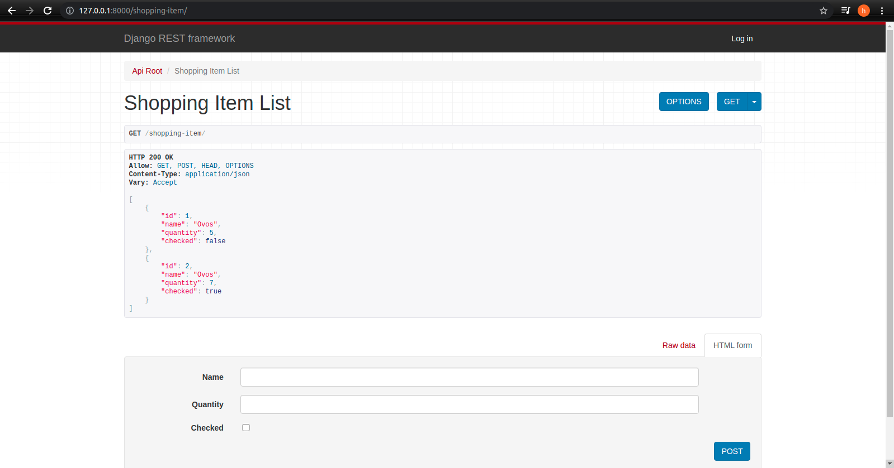

# API Lista de Compras
API desenvolvida com o propositor de Lista da Compra utilizando [Django Rest](https://www.django-rest-framework.org/) que permite ao usuário inserir, consultar e deletar itens em uma lista de compra, que é armazenada em um banco de dados [SqLite](https://www.sqlite.org/index.html).

## Tecnologia requerida

- Python 3.7
- Django 3.2.8
- Django Rest Framework 3.12.4
- django-cors-headers 3.10.0

### Visual da API

	

